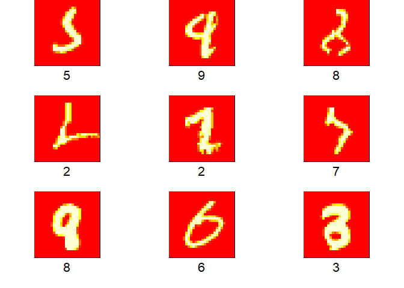

MNIST
================
Ingrid Baade
April 27, 2018

This code uses a model developed by Yassine Ghouzam on Kaggle. Mine is in R not python. I don't use learning rate decay and I havent augmented the data.

I ran this twice; once with rmsprop optimizer (which Yassine used) and then with Adam optimizer. Adam worked better, but neither model is as good as Yassine's. Training set accuracy .9969, validation set accuracy .9947 and test set accuracy .9955.

``` r
library(keras)
#install_keras()

#input layer: use MNIST images 
mnist<-dataset_mnist()
x_train<-mnist$train$x
y_train<-mnist$train$y
x_test<-mnist$test$x
y_test<-mnist$test$y
rm(mnist)

#reshape and rescale
x_train <- array_reshape(x_train,c(dim(x_train),1))
x_test <- array_reshape(x_test, c(dim(x_test),1))
x_train<-x_train/255
x_test<-x_test/255

y_train<-to_categorical(y_train, 10)
actual<-y_test
y_test<-to_categorical(y_test, 10)

# For reproducible results across R, python, numpy and tensorflow, use the following. 
# It needs to disable parallel cpu for full reproducibility
#use_session_with_seed(666, disable_parallel_cpu = FALSE)
set.seed(666)

#kaggle kernel adapted from Yassine Ghouzam
model <- keras_model_sequential()

model %>% 
  layer_conv_2d(filters=32, kernel_size = 5, padding = 'same', activation ='relu', input_shape = c(28,28,1)) %>%
  layer_conv_2d(filters=32, kernel_size = 5, padding = 'same', activation ='relu') %>% 
  layer_max_pooling_2d(pool_size = c(2,2)) %>%
  layer_dropout(0.25) %>%
  layer_conv_2d(filters=64, kernel_size = 3, padding = 'same', activation ='relu') %>%
  layer_conv_2d(filters=64, kernel_size = 3, padding = 'same', activation ='relu') %>%
  layer_max_pooling_2d(pool_size = 2, strides= 2) %>%
  layer_dropout(0.25) %>%
  layer_flatten() %>%
  layer_dense(units=256,activation= "relu") %>% 
  layer_dropout(0.5) %>%
  layer_dense(units=10, activation = "softmax")

# compile (define loss and optimiser)
model %>% compile(
  loss = "categorical_crossentropy", 
#  optimizer = optimizer_rmsprop(), 
  optimizer = optimizer_adam(), 
  metrics=c("accuracy")
)

history <- model %>% fit( 
  x_train, y_train, 
  epochs=20, batch_size=128, 
  validation_split = 0.1
  )

plot(history)

model %>% evaluate(x_test, y_test)

predicted<-predict_classes(model,x_test)

table(predicted, actual)

summary(model)

wrong<-which(actual!=predicted)
#wrong_rmsprop_20 <- wrong
wrong_adam_20 <- wrong

rm(x_train)
rm(y_train)
rm(x_test)
rm(y_test)
rm(actual)
rm(predicted)
```

Nine digits both models got wrong:

``` r
library(keras)
mnist<-dataset_mnist()
x_test<-mnist$test$x
y_test<-mnist$test$y
rm(mnist)

# this is how I found the digits both models got wrong, needs beautifying.
#sort(table(c(wrong_adam_20, wrong_rmsprop_20)))

par(pty="s")
par(mfrow=c(3,3))
par(mar=c(4,1,0,1))
for (i in c(1015, 1183, 1233, 1248, 1261, 1394, 1879, 1902, 2036) ){
  image(t(x_test[i,,])[,28:1], xaxt="n", yaxt="n")
  title(xlab=y_test[i], line=1, cex.lab=2)
}
```


Nine digits only one model got wrong:

``` r
par(pty="s")
par(mfrow=c(3,3))
par(mar=c(4,1,0,1))
for (i in c(341,  360,  583,  647,  660,  727,  948,  966, 1115) ){
  image(t(x_test[i,,])[,28:1], xaxt="n", yaxt="n")
  title(xlab=y_test[i], line=1, cex.lab=2)
}
```



``` r
# ^ should be written in a function


rm(x_test)
rm(y_test)
```
