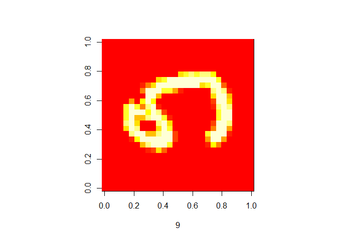

MNIST
================
Ingrid Baade
April 27, 2018

This code uses a model developed by Yassine Ghouzam on Kaggle. Mine is in R not python. I don't use learning rate decay and I havent augmented the data.

I ran this twice; once with rmsprop optimizer (which Yassine used) and then with Adam optimizer. Adam worked better, but neither model is as good as Yassine's. Training set accuracy .9969, validation set accuracy .9947 and test set accuracy .9955.

``` r
library(keras)
#install_keras()

#input layer: use MNIST images 
mnist<-dataset_mnist()
x_train<-mnist$train$x
y_train<-mnist$train$y
x_test<-mnist$test$x
y_test<-mnist$test$y
rm(mnist)

#reshape and rescale
x_train <- array_reshape(x_train,c(dim(x_train),1))
x_test <- array_reshape(x_test, c(dim(x_test),1))
x_train<-x_train/255
x_test<-x_test/255

y_train<-to_categorical(y_train, 10)
actual<-y_test
y_test<-to_categorical(y_test, 10)

set.seed(666)

#kaggle kernel adapted from Yassine Ghouzam
model <- keras_model_sequential()

model 
  layer_conv_2d(model, filters=32, kernel_size = 5, padding = 'same', activation ='relu', input_shape = c(28,28,1)) 
  layer_conv_2d(model, filters=32, kernel_size = 5, padding = 'same', activation ='relu')  
  layer_max_pooling_2d(model, pool_size = c(2,2)) 
  layer_dropout(model, 0.25) 
  layer_conv_2d(model, filters=64, kernel_size = 3, padding = 'same', activation ='relu') 
  layer_conv_2d(model, filters=64, kernel_size = 3, padding = 'same', activation ='relu') 
  layer_max_pooling_2d(model, pool_size = 2, strides= 2) 
  layer_dropout(model, 0.25) 
  layer_flatten(model) 
  layer_dense(model, units=256,activation= "relu") 
  layer_dropout(model, 0.5)
  layer_dense(model, units=10, activation = "softmax")
  
#compile (define loss and optimiser)

model %>%
  compile(loss="categorical_crossentropy", optimizer=optimizer_rmsprop(), metrics=c("accuracy"))

#model %>%
#  compile(loss="categorical_crossentropy", optimizer=optimizer_adam(), metrics=c("accuracy"))


#train (fit)
history <- model %>%
  fit(x_train, y_train, epochs=30, batch_size=128, validation_split = 0.1)

plot(history)

model %>% evaluate(x_test, y_test)

predicted<-predict_classes(model,x_test)

table(predicted, actual)

summary(model)


wrong<-which(actual!=predicted)


rm(x_train)
rm(y_train)
rm(x_test)
rm(y_test)
rm(actual)
rm(predicted)
```

Seven of the 24 digits both models got wrong:

``` r
library(keras)
mnist<-dataset_mnist()
x_test<-mnist$test$x
y_test<-mnist$test$y
rm(mnist)

#not necessary for code to work, but this is how I found the digits both models got wrong.
#sort(table(c(wrong_adam, wrong_rmsprop)))

par(pty="s")
#sorry they are on their sides
image(x_test[948,,],xlab=y_test[948])
```


``` r
image(x_test[1015,,],xlab=y_test[1015])
```


``` r
image(x_test[1040,,],xlab=y_test[1040])
```


``` r
image(x_test[1248,,],xlab=y_test[1248])
```



``` r
image(x_test[1710,,],xlab=y_test[1710])
```


``` r
image(x_test[1879,,],xlab=y_test[1879])
```


``` r
image(x_test[2036,,],xlab=y_test[2036])
```


``` r
rm(x_test)
rm(y_test)
```
